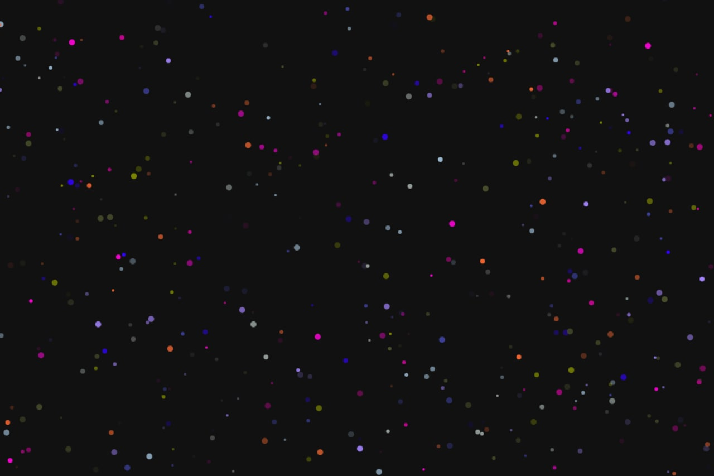

# Happy BirthDay JS

Happy Birthday is a web-based party live background generated by **CANVAS** powered by **JavaScript**. This show a lot of random colorize **particles** in the background.

Click or touch the page for playing Happy Birthday music.

**Demo:** https://basemax.github.io/HappyBirthDayJS/

Source: I followed the same idea but I did it in an easier and cleaner way. Enjoy your party and dance. The music copyright is for Andy and the music name is Tavalod.
